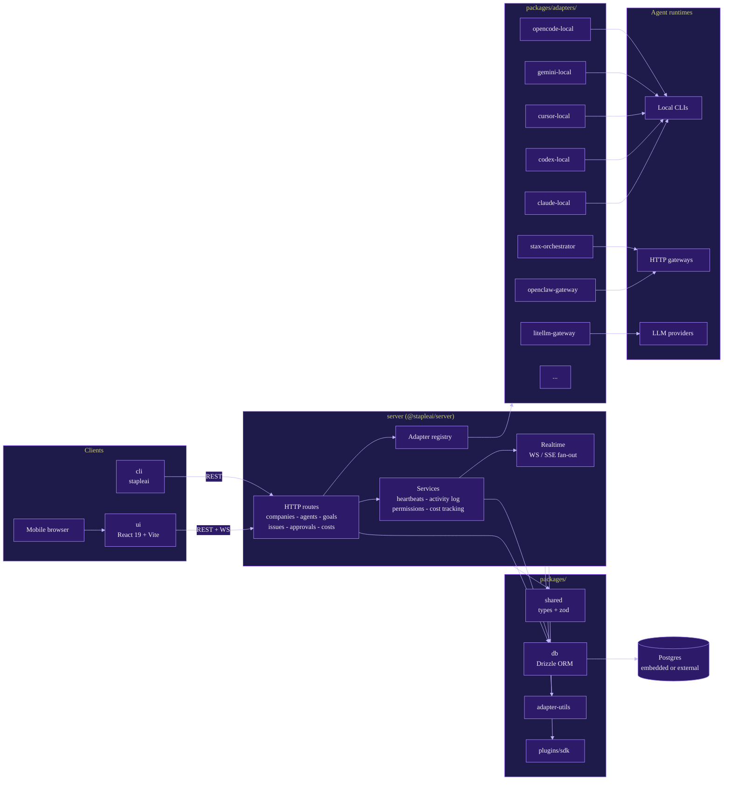

# staple-ai

Open-source orchestration for zero-human companies.

## Table of Contents

- [Overview](#overview)
- [Architecture](#architecture)
- [Quick Start](#quick-start)
- [Development](#development)
- [Testing](#testing)
- [Deployment](#deployment)
- [Sub-Modules](#sub-modules)

## Overview

Staple is a Node.js API server and React dashboard that orchestrates a team of heterogeneous AI agents into something that behaves like a company: org charts, goals, budgets, governance, tickets, and a full audit log.

You bring agents (Claude Code, Codex, Cursor, Gemini, OpenClaw, opencode, libai, pi, LiteLLM, or any HTTP runtime), assign them roles and goals, and Staple handles the hard parts of running them as a team:

- **Atomic task checkout** and budget enforcement so agents don't double-work or run away with spend
- **Persistent agent state** that survives heartbeats, restarts, and reboots
- **Runtime skill injection** so agents learn Staple workflows without retraining
- **Goal ancestry** so every task carries the "why," not just a title
- **Governance with rollback** on approvals, config changes, and strategy
- **True multi-company isolation** — one deployment, many companies, separate data and audit trails
- **Portable company templates** — export and import whole orgs with secret scrubbing

Staple is not a chatbot, not an agent framework, not a workflow builder. It models the organization your agents work in.

## Architecture

Staple is a pnpm monorepo. The server is the control plane and the single source of truth. The UI and CLI are thin clients over the server's HTTP API. Adapters translate the server's uniform agent contract into whatever each runtime expects. Plugins extend all of this without forking core.



## Quick Start

Open source. Self-hosted. No account required.

```bash
npx stapleai onboard --yes
```

Or from source:

```bash
git clone https://github.com/stapleai/staple.git
cd staple
pnpm install
pnpm dev
```

The API and UI are served at `http://localhost:3100`. Embedded Postgres is provisioned automatically on first run.

Requirements: Node.js 20+, pnpm 9.15+.

## Development

```bash
pnpm dev              # server + UI, watch mode
pnpm dev:once         # server + UI, no watch
pnpm dev:server       # server only
pnpm dev:ui           # UI only
pnpm build            # build all workspaces
pnpm typecheck        # type-check all workspaces
pnpm db:generate      # generate a Drizzle migration
pnpm db:migrate       # apply migrations
pnpm check:tokens     # forbidden-token guard
```

Full contributor guide: [`doc/DEVELOPING.md`](doc/DEVELOPING.md).

## Testing

Unit and integration tests live next to code (vitest). E2E tests live in [`tests/e2e/`](tests/README.md) (Playwright).

```bash
pnpm test:run         # all vitest suites
pnpm test:e2e         # Playwright headless
pnpm test:e2e:headed  # Playwright with browser
```

Smoke tests for agent runtimes:

```bash
pnpm smoke:openclaw-join
pnpm smoke:openclaw-docker-ui
pnpm smoke:openclaw-sse-standalone
```

## Deployment

Supported targets:

- **Local single-process** — embedded Postgres, file storage, best for solo use
- **Docker Compose** — `docker-compose.yml` (Postgres + server) or `docker-compose.quickstart.yml`
- **Self-hosted** — build the image, point `DATABASE_URL` at external Postgres, deploy anywhere Node runs (Vercel, Fly, Render, bare metal)
- **Untrusted PR review sandbox** — `docker-compose.untrusted-review.yml` (see `doc/UNTRUSTED-PR-REVIEW.md`)

Deployment modes, auth modes, and exposure settings: `doc/DEPLOYMENT-MODES.md` and `docs/DEPLOYMENT-WORKFLOW.md`. Release process: `doc/RELEASING.md`.

## Sub-Modules

- [`server/`](server/README.md) — `@stapleai/server`, the API and realtime control plane
- [`ui/`](ui/README.md) — `@stapleai/ui`, the React dashboard
- [`cli/`](cli/README.md) — `stapleai`, the installable CLI
- [`packages/`](packages/README.md) — shared libraries, adapters, and plugin SDK
  - [`packages/shared/`](packages/shared/README.md) — cross-cutting types and zod schemas
  - [`packages/db/`](packages/db/README.md) — Drizzle schema and migrations
  - [`packages/adapter-utils/`](packages/adapter-utils/README.md) — shared adapter helpers
  - [`packages/adapters/`](packages/adapters/README.md) — agent runtime adapters
  - [`packages/plugins/`](packages/plugins/README.md) — plugin SDK, scaffolder, examples
- [`skills/`](skills/README.md) — runtime-injected skill bundles
- [`scripts/`](scripts/README.md) — dev, release, smoke, and guard scripts
- [`docker/`](docker/README.md) — ancillary Docker build contexts
- [`docs/`](docs/README.md) — public documentation site (Mintlify)
- [`doc/`](doc/README.md) — internal specs, plans, and release notes
- [`sdlc/`](sdlc/README.md) — built-in SDLC role prompts
- [`tests/`](tests/README.md) — top-level E2E suites
- [`releases/`](releases/README.md) — per-version release notes
- [`report/`](report/README.md) — dated engineering reports

## License

MIT. See [`LICENSE`](LICENSE).
